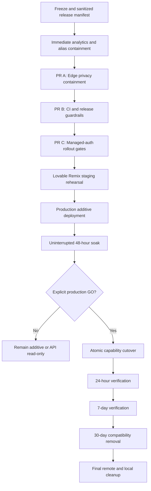

# Snote Production Security Rollout Implementation Plan

> **For agentic workers:** REQUIRED SUB-SKILL: Use `executing-plans` to implement this plan task-by-task. Use `test-driven-development` for code changes, `systematic-debugging` for failures, and `verification-before-completion` before every commit, PR, merge, deployment, or completion claim.

**Goal:** Complete the Snote security rollout from the audited `main` baseline while protecting existing notes, eliminating capability leakage, proving the Lovable-managed backend configuration, restoring trustworthy release gates, and leaving GitHub with only the `main` branch after all required compatibility windows have closed.

**Architecture:** Snote remains an accountless, client-side-encrypted application. A slug is only a locator; an unguessable capability is the authority. The browser exchanges a capability for a short-lived `NoteSession`, persists idempotent encrypted Yjs updates through narrow Edge APIs, and defaults to polling until managed Realtime authorization is proven safe. Cloudflare is the public security boundary for response headers, path privacy, alias containment, and analytics blocking. Lovable continues to manage the existing Supabase project; this plan does not create a second Supabase project or require end-user accounts.

**Tech Stack:** React, TypeScript, Vite, Bun, Vitest, Playwright, Yjs, Supabase/Lovable Cloud, Supabase Edge Functions, PostgreSQL/RLS, Cloudflare Workers, GitHub Actions.

---

## 1. Approval, baseline, and change-control status

This document records the plan approved on 2026-07-28. Approval of this document does **not** authorize an atomic production migration, data deletion, secret rotation, branch deletion, or local worktree discard. Those actions require the explicit checkpoints named below.

Approved source baseline:

- Repository: `sovergarden-dev/snote`
- Branch: `main`
- Commit: `241be9fe79a4d4956fc5bec88d73c2c1b108f9f5`
- Planning worktree: `work/snote-pr8-router8-wt`
- The planning worktree was clean and detached at the approved commit when this document was created.
- GitHub remote contained only `main` after the prior stacked branches were merged and removed.
- CI and extension checks were green on the baseline, but production readiness remains conditional on the gates in this plan.

Observed production inventory at audit time:

- 51 notes.
- 3 legacy tables.
- 11 deployed Edge Functions.
- 4 Lovable security warnings.
- Lovable/Flock analytics injected `/~flock.js` and could observe the pathname or full URL.
- Production responses did not consistently prove the required CSP, Permissions Policy, private-route cache policy, and no-index policy.
- A direct Lovable-hosted alias could bypass the Cloudflare boundary.
- The post-deploy PWA smoke workflow had no successful production run.
- `main` did not yet have the final required branch/ruleset protections.

Known release blockers:

- Migration ordering is unsafe if `20260724000000_atomic_capability_cutover.sql` precedes `20260727000000_capability_conflict_prevention.sql` in a fresh or partially applied environment.
- Old runbooks still mention custom JWT handling and `CAPABILITY_WRITE_DISABLED`.
- The required soak verifier, anonymous-auth cleanup function, staging gate, and complete cutover manifest are not yet present.
- Production backup and recovery evidence has not yet been attached to a release manifest.

## 2. Non-negotiable invariants

- Do not create a separate Supabase project unless Lovable support proves the managed project cannot satisfy a required control and the user approves a migration.
- Do not add user accounts. Anonymous authentication may create a short-lived transport identity, but capability possession remains the authorization source.
- Never log note contents, decrypted text, ciphertext payloads, slugs, capabilities, share tokens, raw URLs containing fragments, or raw IP addresses.
- Capabilities travel in URL fragments for the SPA and in `Authorization: Bearer` for API clients. They never travel in query strings or server-visible paths.
- Never restore direct anonymous table writes as a rollback mechanism.
- Roll back with database runtime flags and an API read-only mode.
- Legacy notes remain exact-match read-only and can be duplicated into the secure model. Do not silently assign ownership using first claim.
- Default to polling. Enable private Realtime only if the managed platform can issue scope-bound JWTs with a lifetime of at most 300 seconds and all relevant logs are proven redacted.
- All encrypted updates, checkpoints, outbox records, and local disaster snapshots remain encrypted client-side.
- No production cutover occurs before an uninterrupted 48-hour soak of the exact production candidate.
- No destructive cleanup occurs before an inventory, a recoverability decision, and explicit user approval.
- Keep one temporary remote implementation branch at a time. Delete it immediately after its PR is safely merged.

## 3. Release flow



## 4. Checkpoints requiring explicit approval

The implementing worker must stop and obtain a separate approval before each of these actions:

1. Mutating Cloudflare or Lovable production settings.
2. Creating or changing a paid service, backup plan, or support plan.
3. Rotating any production key, token, password, or admin secret.
4. Applying any production database migration or deploying a production Edge Function.
5. Enabling production anonymous authentication, Turnstile, or private Realtime.
6. Starting the 48-hour production soak.
7. Executing the atomic capability cutover.
8. Removing the 30-day legacy compatibility shell.
9. Deleting dirty local worktrees or untracked files.

## 5. Task 0 — Freeze, manifest, and tracking issue

**Files:**

- Create: `docs/security/release-manifests/2026-07-capability-rollout.md`
- Create or update: a sanitized GitHub tracking issue
- Reference: `docs/superpowers/plans/2026-07-24-lovable-managed-realtime-auth.md`

### Steps

- [ ] Stop unrelated production deploys until the additive release and cutover are complete.
- [ ] Record the release commit, candidate branch, GitHub run IDs, Cloudflare Worker version, Lovable deployment identifier, migration ledger, Edge Function versions, and backup evidence.
- [ ] Record only secret names and fingerprints. Never paste secret values into Git, GitHub issues, PRs, CI artifacts, screenshots, or chat.
- [ ] Export the current Cloudflare routes, Worker settings, DNS/alias configuration, GitHub rulesets, GitHub Actions variables, Lovable authentication settings, Lovable Edge Function inventory, and database migration ledger.
- [ ] Make the tracking issue the single checklist for PRs, staging evidence, soak evidence, cutover approval, and cleanup windows.

### Baseline commands

Run from the repository root:

```powershell
git status --short --branch
git rev-parse HEAD
git remote -v
git ls-remote --heads origin
gh pr list --state open
gh issue list --state open
gh run list --branch main --limit 20
```

Expected result:

- HEAD equals the release candidate commit recorded in the manifest.
- Worktree changes are fully explained.
- No unexpected remote branches or open stacked PRs exist.
- No secret values appear in captured output.

## 6. Task 1 — Immediate analytics and alias containment

This is the highest-priority production containment. It precedes the capability cutover because URL/path telemetry can leak the legacy locator or sharing material.

### Steps

- [ ] Use a synthetic note/share token to determine whether `/~flock.js`, `/~api/analytics`, browser requests, Cloudflare logs, Lovable logs, or analytics dashboards retain the pathname, fragment, referrer, or full URL.
- [ ] Configure the Cloudflare Worker to answer `/~flock.js` with `410 Gone` and `Cache-Control: no-store`.
- [ ] Configure the Worker to answer `/~api/analytics` with `204 No Content` or `410 Gone` and `Cache-Control: no-store`.
- [ ] Ensure these denials occur before the request reaches the Lovable origin.
- [ ] Disable Lovable/Flock analytics. If the UI has no complete switch, open a support request for disablement, deletion, retention limits, and confirmation that URL data is not retained.
- [ ] Route every public hostname through the Worker.
- [ ] Make the direct Lovable alias private, inaccessible, or behaviorally equivalent to the Worker boundary.
- [ ] Disable request-body logging, raw URL logging, and raw trace capture for private paths.
- [ ] Purge cached HTML and analytics scripts. Do not purge immutable hashed assets without a reason.
- [ ] Produce only an aggregate exposure inventory: time window, affected endpoint class, count, and remediation state.
- [ ] If synthetic evidence proves real capability exposure, prepare a scoped token/share rotation proposal and request a separate approval.

### Verification

```powershell
curl.exe -sS -D - -o NUL https://note.syrin.online/~flock.js
curl.exe -sS -D - -o NUL https://note.syrin.online/~api/analytics
curl.exe -sS -D - -o NUL https://note.syrin.online/private-synthetic-path
```

Expected result:

- The analytics script is unavailable and uncacheable.
- The analytics collection endpoint does not reach the origin.
- Private synthetic paths are uncacheable and non-indexable.
- No raw synthetic token is present in any inspected log or dashboard.

The analytics deny has no rollback path. If analytics is needed later, introduce a privacy-reviewed aggregate event system that never includes a URL, path, slug, capability, note identifier, content, or raw IP address.

## 7. Task 2 — PR A: `security/edge-privacy-containment`

Create one temporary branch from the latest verified `main`.

**Files:**

- Modify: `cloudflare-worker/worker.js`
- Modify: `cloudflare-worker/worker.share-containment.test.ts`
- Create: `cloudflare-worker/worker.edge-privacy.test.ts`
- Modify: `cloudflare-worker/wrangler.toml`
- Create: `cloudflare-worker/wrangler.staging.toml`
- Modify: `vercel.json`
- Modify: `public/_headers`
- Modify: `public/robots.txt`
- Modify: `src/pages/Privacy.tsx`
- Modify: `.github/workflows/pwa-update-smoke-post-deploy.yml`
- Modify: `scripts/__tests__/application-log-privacy.test.ts`
- Create: `scripts/__tests__/edge-privacy-contract.test.ts`
- Modify: `scripts/verify-frame-ancestors.sh`

### Required behavior

- [ ] Treat the Cloudflare Worker as the production header and cache-policy source of truth.
- [ ] Allow public caching only for `/`, `/privacy`, and immutable static assets.
- [ ] Apply `Cache-Control: private, no-store`, `Pragma: no-cache`, `Expires: 0`, `X-Robots-Tag: noindex, nofollow, noarchive, nosnippet`, and `Referrer-Policy: no-referrer` to note, share, unlock, embed, API-error, and compatibility-shell HTML.
- [ ] Strip `ETag`, `Last-Modified`, reporting endpoints, and telemetry headers from private HTML.
- [ ] Add an explicit, minimal `Permissions-Policy`.
- [ ] Do not add `X-Frame-Options`; it conflicts with the extension/embed model.
- [ ] Use this initial CSP:

```text
default-src 'self'; base-uri 'none'; object-src 'none'; form-action 'self'; frame-ancestors 'self' chrome-extension://*; script-src 'self' https://challenges.cloudflare.com; style-src 'self' 'unsafe-inline'; img-src 'self' data: blob: https://flagcdn.com https://pub-bb2e103a32db4e198524a2e9ed8f35b4.r2.dev; font-src 'self' data:; connect-src 'self' https://onfzjmfjldsbthchssfr.supabase.co wss://onfzjmfjldsbthchssfr.supabase.co https://challenges.cloudflare.com; frame-src https://challenges.cloudflare.com; worker-src 'self' blob:; manifest-src 'self'; upgrade-insecure-requests;
```

- [ ] Narrow `chrome-extension://*` to the stable published extension identifier after that identifier is confirmed.
- [ ] Make the Privacy page accurately describe Lovable-managed infrastructure, Cloudflare, optional anonymous authentication, local encryption, no IP geolocation service, operational retention, and the absence of raw content/token analytics.
- [ ] Ensure crawler, share, and legacy compatibility responses are generic and contain no slug, capability, note title, or decrypted content.
- [ ] Trigger post-deploy PWA smoke using an authenticated GitHub dispatch rather than a browser token.

### Tests first

Add failing tests for:

- analytics endpoints denied before origin;
- public/private route classification;
- CSP and frame-ancestor policy;
- private cache and indexing headers;
- absence of raw URL/token logging;
- alias host behavior;
- PWA dispatch payload validation.

### Local verification

```powershell
bun install --frozen-lockfile
bun run lint
bun run test -- cloudflare-worker/worker.share-containment.test.ts cloudflare-worker/worker.edge-privacy.test.ts
bun run test -- scripts/__tests__/application-log-privacy.test.ts scripts/__tests__/edge-privacy-contract.test.ts
bun run build:check
bash scripts/verify-frame-ancestors.sh
```

### PR acceptance

- [ ] All focused tests fail before the implementation and pass after it.
- [ ] The complete repository gate passes.
- [ ] Staging responses prove the exact intended headers.
- [ ] The PR contains threat model, rollback, deployment order, and sanitized evidence.
- [ ] Merge only after required checks pass; delete the temporary remote branch immediately after merge.

## 8. Task 3 — PR B: `ci/release-guardrails`

**Files:**

- Modify: `.github/workflows/ci.yml`
- Modify: `.github/workflows/extension-e2e.yml`
- Modify: `.github/workflows/pwa-update-smoke-post-deploy.yml`
- Delete or fold in: redundant workflow files
- Create: `.github/dependabot.yml`
- Create: `SECURITY.md`
- Create conditionally: `.github/CODEOWNERS`
- Modify: action references in all retained workflow files

### Workflow policy

- [ ] Retain exactly three workflows: primary CI, extension E2E, and post-deploy PWA smoke.
- [ ] Put the Lovable Remix staging gate in the primary CI workflow rather than adding a fourth workflow.
- [ ] Make `extension-e2e` always report a check on pull requests. For unrelated diffs, it may complete as a documented no-op.
- [ ] Pin third-party actions to audited immutable commit SHAs.
- [ ] Use Bun's pinned project version everywhere.
- [ ] Do not use blanket retries. Pull requests run a critical Chromium smoke with `retries=0`; full browser coverage runs on `main`, nightly, or manual dispatch.
- [ ] Required checks are `quality`, `e2e-pr`, and `extension-e2e`.
- [ ] Configure Dependabot for Bun and GitHub Actions weekly. Group patch/minor updates; do not auto-merge.
- [ ] Add `SECURITY.md` with a private reporting channel and supported-version policy.
- [ ] Add `CODEOWNERS` only if the exact maintainer account/team is confirmed.

### GitHub repository controls

- [ ] Enable dependency graph.
- [ ] Enable Dependabot alerts and security updates.
- [ ] Enable secret scanning and push protection where the repository plan supports them.
- [ ] Enable CodeQL/default setup where compatible.
- [ ] Create a `main` ruleset: prohibit deletion and force pushes, require a PR, require conversation resolution, require strict status checks, enforce linear/squash history, and require the named checks.
- [ ] For a solo repository, use zero mandatory approvals if one approval would deadlock the maintainer, but never allow a failing required check.
- [ ] Do not give Lovable or another integration a broad bypass.

### PWA post-deploy contract

- [ ] Accept `repository_dispatch` and `workflow_dispatch`.
- [ ] Require `deployed_sha`, `build_id`, and `target_url`.
- [ ] Use a protected GitHub `production` environment.
- [ ] Reject a deployed SHA that does not match the release manifest.
- [ ] Do not expose a GitHub token to browser JavaScript.

### Verification

```powershell
actionlint
bun install --frozen-lockfile
bun run lint
bun run knip
bun run i18n:check
bun run i18n:allowlist
bunx tsc --noEmit -p tsconfig.app.json
bunx tsc --noEmit -p tsconfig.node.json
bunx tsc --noEmit -p tsconfig.tools.json
bun run typecheck:edge
bun run test:coverage
bun run build:check
```

After merge:

- [ ] Observe one real PR where all three required checks report.
- [ ] Observe one production dispatch where PWA smoke tests the deployed SHA.
- [ ] Delete the temporary remote branch.

## 9. Task 4 — PR C: `ops/managed-auth-rollout-gates`

**Files:**

- Create: `supabase/functions/anonymous-auth-cleanup/index.ts`
- Create: tests for anonymous-auth cleanup
- Modify: `supabase/config.toml`
- Create: `scripts/verify-capability-soak.ts`
- Create: `scripts/__tests__/verify-capability-soak.test.ts`
- Create: `scripts/__tests__/rollout-contract.test.ts`
- Create: `playwright.staging.config.ts`
- Create: staging E2E specs under `e2e-staging/`
- Create: `cloudflare-worker/wrangler.staging.toml`
- Rewrite: `docs/security/lovable-realtime-auth-rollout.md`
- Modify: `package.json`
- Modify: `.env.example`
- Modify: cutover verifier and migration contract tests

### Anonymous-auth cleanup

- [ ] Delete expired anonymous transport identities without touching note data.
- [ ] Use a conservative retention window longer than the maximum session and offline-recovery window.
- [ ] Make cleanup idempotent, bounded, observable only by aggregate counts, and fail-safe.
- [ ] Do not log user IDs, IP addresses, capabilities, slugs, or note IDs.
- [ ] Document schedule, ownership, failure alert, and manual rerun.

### Managed-auth and Realtime contract

- [ ] Add `NoteSession` as a discriminated union for polling and Realtime modes.
- [ ] A session contains at least `noteId`, `slug`, `scope`, expiry, checkpoint sequence, missing updates, and encryption metadata.
- [ ] For Realtime mode, require a platform-issued, scope-bound JWT with an expiry of at most 300 seconds.
- [ ] Do not expose service-role or custom signing secrets to the SPA.
- [ ] Keep polling as the default and production fallback.
- [ ] Delay connection restarts until unacknowledged outbox data is durably persisted.
- [ ] Prove note A cannot subscribe to or modify note B.

### Required package scripts

Add:

```json
{
  "scripts": {
    "test:realtime-auth": "vitest run scripts/__tests__/capability-realtime-auth.test.ts",
    "test:e2e:lovable-remix": "playwright test --config=playwright.staging.config.ts",
    "soak:verify": "bun scripts/verify-capability-soak.ts"
  }
}
```

Adapt exact paths to the existing repository conventions, but preserve the command names as the rollout contract.

### Migration-order decision

Inspect the production and staging migration ledgers before renaming or applying anything.

- [ ] If `20260724000000_atomic_capability_cutover.sql` has **not** run, rename/resequence it after `20260727000000_capability_conflict_prevention.sql`, update contract tests, and prove a fresh database applies migrations in the intended order.
- [ ] If the atomic migration **has** run anywhere that matters, do not rewrite history. Add a new forward-only corrective migration.
- [ ] Never execute an unreviewed blanket `supabase db push`.

### Runtime control

Remove stale instructions for `CAPABILITY_WRITE_DISABLED` and custom JWT handling. Use the database runtime switch:

```sql
select public.capability_runtime_set(false, false);
```

Meaning:

- first flag: capability writes;
- second flag: legacy compatibility;
- `false, false` is the safe read-only/disabled rollback posture.

Verify the exact function signature against the applied schema before production use.

### Share and compatibility decisions

- [ ] Recheck `note_shares` immediately before the release candidate is frozen.
- [ ] If the table is still empty, keep share revocation tombstoned and do not invent an unnecessary compatibility path.
- [ ] Set a single cutover time before the release candidate and soak.
- [ ] Set the legacy compatibility removal time to cutover plus 30 days.

### Strengthened cutover verifier

The verifier must reject cutover unless all of these match the release manifest:

- release SHA and deployed build ID;
- migration names, ordering, and hashes;
- backup/export timestamp and restore proof;
- Cloudflare Worker version and routes;
- analytics disabled/blocked state;
- Lovable auth and Turnstile state;
- runtime flags;
- Edge Function versions;
- staging rehearsal result;
- uninterrupted soak start/end and candidate identity;
- log-redaction proof;
- compatibility cutoff time;
- explicit production GO record.

### Verification

```powershell
bun run test:realtime-auth
bun run test -- scripts/__tests__/verify-capability-soak.test.ts
bun run test -- scripts/__tests__/rollout-contract.test.ts
bun run test -- scripts/__tests__/capability-backend-contract.test.ts
bun run test -- scripts/__tests__/capability-migration.integration.test.ts
bun run test -- src/lib/legacy/__tests__/migration-contract.test.ts
bun run typecheck:edge
bun run build:check
```

Merge only after the full repository gate passes, then delete the temporary remote branch.

## 10. Task 5 — Lovable Remix staging rehearsal

Create an isolated Lovable Remix/staging environment in the same region as production.

### Environment requirements

- [ ] No production custom domain.
- [ ] No production note data.
- [ ] Separate staging secrets and Turnstile configuration.
- [ ] Cloudflare staging route and `wrangler.staging.toml`.
- [ ] Runtime starts at:

```sql
select public.capability_runtime_set(false, false);
```

### Deployment order

1. Apply containment migrations and containment Edge Functions.
2. Run function-spoof and authorization proofs.
3. Deploy the staging Worker and verify cache/header/analytics policy.
4. Deploy the `note-meta` tombstone behavior.
5. Apply additive capability-backend migrations.
6. Create and verify a staging checkpoint/backup.
7. Audit real payload-size distributions using synthetic or sanitized metadata only.
8. Quarantine or make read-only any payload outside the approved bound; never truncate.
9. Deploy capability Edge Functions.
10. Apply conflict-prevention migration.
11. Deploy the SPA release candidate.
12. Enable capability writes while keeping legacy compatibility disabled:

```sql
select public.capability_runtime_set(true, false);
```

### Staging acceptance

- [ ] Anonymous clients cannot list, update, or delete direct tables.
- [ ] Capability for note A cannot read, subscribe to, update, rename, delete, or rotate shares for note B.
- [ ] Owner, edit, and view scopes are distinct.
- [ ] `note-sync` is idempotent for the same `updateId`.
- [ ] Concurrent saves and reversed acknowledgement order do not lose edits.
- [ ] Navigation under 800 ms does not drop the outbox.
- [ ] An encrypted split pane does not mount editor or preview content before unlock.
- [ ] Lock purges plaintext from memory and caches.
- [ ] Crawler/share/legacy responses disclose no slug, capability, note title, or content.
- [ ] Share revocation takes effect immediately and is not served from cache.
- [ ] Admin limiter is atomic under concurrent failures and fails closed when the database is unavailable.
- [ ] PWA remains usable offline when an update stalls.
- [ ] No request goes to `ipapi.co`.
- [ ] Privacy text matches manifest, runtime, and operational retention.
- [ ] Axe passes on Home, Note, Split, Share, and Unlock in mobile and desktop viewports.
- [ ] Rollback drill to `false, false` works without restoring table grants.

### Realtime decision

Start with polling. Enable staging private Realtime only if all are proven:

- Lovable-managed anonymous authentication works with Turnstile.
- JWT lifetime is at most 300 seconds.
- JWT claims are bound to one note and one scope.
- `realtime.messages` authorization denies cross-note access.
- browser, Edge Function, Lovable, Supabase, and Cloudflare logs redact authorization material and raw private URLs.
- reconnect, expiry, refresh, outbox replay, and rollback tests pass.

If any condition fails, record polling as the production mode and continue. Realtime is an optimization, not a release blocker.

## 11. Task 6 — Production additive deployment

This task requires a separate production mutation approval.

### Pre-deploy

- [ ] Freeze the release manifest and exact artifact.
- [ ] Choose cutover time `T`.
- [ ] Choose compatibility cutoff `T + 30 days`.
- [ ] Create a production backup/checkpoint.
- [ ] Prove recovery using an encrypted logical export or a supported backup/restore rehearsal.
- [ ] If acceptable recovery requires a paid Lovable/Supabase plan, present the cost and benefit and obtain approval before purchase.
- [ ] Confirm analytics containment and alias containment are already active.
- [ ] Confirm GitHub required checks and the post-deploy PWA workflow are active.

### Deployment order

Repeat the staging-proven order exactly:

1. Containment migrations and functions.
2. Function-spoof proof.
3. Worker/cache policy.
4. `note-meta` tombstone.
5. Additive capability backend.
6. Checkpoint verification.
7. Payload audit and quarantine.
8. Capability functions.
9. Conflict prevention.
10. SPA release candidate.
11. Runtime `true, false`.

Use polling only at initial production activation. Realtime may be enabled later only if the staging decision and production log proof both pass.

### Production additive acceptance

- [ ] Create synthetic owner, edit, view, encrypted, legacy, revoked-share, and oversize/quarantined canaries.
- [ ] Confirm exact build ID and release SHA.
- [ ] Confirm no direct anonymous table mutation.
- [ ] Confirm no raw telemetry.
- [ ] Confirm PWA post-deploy smoke passes.
- [ ] Rotate the admin session/secret only if the manifest explicitly requires it and approval was obtained.

## 12. Task 7 — Uninterrupted 48-hour production soak

This task requires explicit approval to start.

### Rules

- [ ] Soak the exact artifact intended for cutover for at least `172800` consecutive seconds.
- [ ] Restart the timer after any application build, Edge Function, database schema, Worker, auth, Turnstile, routing, or relevant configuration change.
- [ ] Record aggregate counters only.
- [ ] Run the automated soak verifier at the start, periodically, and immediately before cutover.

### Aggregate metrics

- API success/error count by endpoint class.
- authorization-denial count by scope class.
- outbox depth buckets and maximum age bucket.
- compaction/checkpoint failure count.
- anonymous-auth cleanup count/failure count.
- Realtime reconnect/expiry counts only if Realtime is enabled.
- PWA smoke pass/failure.

### Immediate NO-GO conditions

- Any cross-note authorization success.
- Any raw capability, slug, URL, note ID, note content, ciphertext payload, or raw IP found in logs.
- Any lost edit, unacknowledged outbox deletion, or non-idempotent duplicate.
- Any encrypted content mounted before unlock.
- Any failed backup/recovery proof.
- Any release/configuration drift from the manifest.
- Any required check or production smoke failure.
- Any unexplained admin-limiter fail-open behavior.

## 13. Task 8 — Atomic capability cutover

This task requires a new explicit **GO** after the 48-hour evidence is complete.

### Final preflight

- [ ] Freeze unrelated deploys.
- [ ] Create a fresh checkpoint.
- [ ] Run the strengthened cutover verifier.
- [ ] Compare deployed SHA, build ID, Worker version, Edge Functions, migrations, auth settings, runtime flags, and soak evidence with the release manifest.
- [ ] Confirm the operator has a tested rollback command and can reach Lovable/Cloudflare/GitHub.
- [ ] Do not push a new build or merge another PR during cutover.

### Cutover

- [ ] Apply the reviewed atomic cutover migration in the proven order.
- [ ] Revoke all anon/auth direct-table privileges.
- [ ] Remove any policy whose effective condition is unbounded `true`.
- [ ] Keep only narrow API/RPC access.
- [ ] Enable exact-match legacy read-only compatibility for the 30-day window.
- [ ] Do not infer owner capability for a legacy note.

### Immediate verification

- [ ] Anonymous table list/update/delete fails.
- [ ] Capability A cannot touch note B.
- [ ] Owner/edit/view scope tests pass.
- [ ] Rename, delete, rotation, and encryption-state transitions require owner scope.
- [ ] Legacy exact-match note is read-only, generic, `no-store`, and offers secure duplicate.
- [ ] Secure duplicate is idempotent.
- [ ] `/s/:token` compatibility shell moves material to the fragment without caching or indexing.
- [ ] Revoked access fails immediately.
- [ ] Direct origin aliases enforce the same policy as the canonical origin.
- [ ] Post-deploy PWA smoke passes against the deployed SHA.

### Rollback

Use the verified runtime switch:

```sql
select public.capability_runtime_set(false, false);
```

Then:

- [ ] Put the API into read-only mode.
- [ ] Preserve append-only updates and checkpoints.
- [ ] Keep direct table grants revoked.
- [ ] Preserve forensic evidence without recording sensitive values.
- [ ] Do not redeploy the insecure legacy policies.

## 14. Task 9 — Post-cutover verification and compatibility retirement

### At 24 hours

- [ ] Re-run capability isolation, direct-table denial, share revocation, encrypted unlock, PWA, alias, and privacy probes.
- [ ] Compare aggregate errors/outbox age with soak thresholds.
- [ ] Close only issues whose evidence is attached.

### At 7 days

- [ ] Repeat security probes.
- [ ] Confirm anonymous-auth cleanup succeeds.
- [ ] Confirm checkpoint compaction and recovery.
- [ ] Confirm no raw telemetry or stale cache.
- [ ] Review Dependabot and CodeQL findings; fix only verified, in-scope findings.

### At 30 days

This step requires separate approval.

- [ ] Remove the legacy `/s/:token` compatibility shell.
- [ ] Remove obsolete legacy Edge compatibility functions and routes.
- [ ] Remove stale runtime flags only after a forward-only migration and rollback review.
- [ ] Purge compatibility caches.
- [ ] Update Privacy, SECURITY, runbooks, extension listing, and release manifest.
- [ ] Re-run the complete acceptance suite.

## 15. Task 10 — Final repository and worktree cleanup

Remote cleanup is allowed only after every required PR is merged and no compatibility branch is needed.

### Remote

- [ ] Confirm all intended commits are reachable from `origin/main`.
- [ ] Confirm there are no open PRs tied to temporary branches.
- [ ] Delete merged temporary branches.
- [ ] Verify the remote branch inventory contains only `main`.

```powershell
git fetch --prune origin
git ls-remote --heads origin
gh pr list --state open
```

### Local

The audit found 13 local worktrees, including 7 with changes. Do not bulk-delete them.

- [ ] Generate a manifest containing path, branch/detached state, HEAD, tracked changes, untracked files, and reachability from `origin/main`.
- [ ] Classify each changed worktree as already merged, unique recoverable work, generated artifact only, or unknown.
- [ ] Back up unique work with a patch/bundle or ask the user for explicit discard approval.
- [ ] Remove only clean, fully merged worktrees first.
- [ ] Remove dirty worktrees only after recoverability or explicit discard is documented.
- [ ] Prune stale worktree metadata.
- [ ] Keep the main checkout and any user-approved archive only.

Safe read-only inventory:

```powershell
git worktree list --porcelain
git branch --all --verbose --no-abbrev
git status --short --branch
```

Do not run recursive delete commands against the workspace root.

## 16. Full release verification gate

Run from a clean worktree at the exact release commit:

```powershell
bun install --frozen-lockfile
bun audit --production
bun run lint
bun run knip
bun run i18n:check
bun run i18n:allowlist
bunx tsc --noEmit -p tsconfig.app.json
bunx tsc --noEmit -p tsconfig.node.json
bunx tsc --noEmit -p tsconfig.tools.json
bun run typecheck:edge
bun run test:coverage
bun run build:check
bun run test:realtime-auth
bun run test:e2e:lovable-remix
actionlint
```

Then run the production-safe probes and GitHub checks recorded in the release manifest.

No completion claim is valid unless the latest output is attached or linked and the tested SHA equals the deployed SHA.

## 17. Definition of done

The rollout is complete only when all items are true:

- [ ] Lovable/Flock analytics is disabled and denied at the edge.
- [ ] Every public alias is contained by the same security boundary.
- [ ] Private routes are uncacheable, non-indexable, and protected by the approved headers.
- [ ] A backup and recovery procedure is proven.
- [ ] Capability backend and narrow Edge APIs are deployed.
- [ ] Anonymous/authenticated direct-table mutation is revoked.
- [ ] Capability scope isolation is proven.
- [ ] Polling is stable, or private Realtime meets the short-lived managed-JWT and redaction requirements.
- [ ] Admin rate limiting is atomic and fail-closed.
- [ ] Encrypted notes never mount plaintext before unlock.
- [ ] The exact candidate passed an uninterrupted 48-hour soak.
- [ ] Atomic cutover and rollback were verified.
- [ ] GitHub `main` is protected by the required checks.
- [ ] A real post-deploy PWA smoke passed for the deployed SHA.
- [ ] GitHub security features and dependency monitoring are enabled as supported.
- [ ] Privacy, runtime, extension permissions/listing, and retention statements agree.
- [ ] The 30-day legacy compatibility window is retired.
- [ ] GitHub remote contains only `main`.
- [ ] Local worktrees were cleaned without losing unique user work.

## 18. Minimum calendar

- Day 0: freeze, manifest, analytics and alias containment.
- Days 1–2: PR A, PR B, and PR C.
- Days 2–3: Lovable Remix staging rehearsal and rollback drill.
- Days 3–4: approved production additive deployment.
- Days 4–6: uninterrupted 48-hour soak.
- Day 6 or later: explicit-GO atomic cutover.
- Day 7 or later: 24-hour verification.
- Day 13 or later: 7-day verification.
- Cutover plus 30 days: compatibility retirement and final cleanup.

This is a minimum, not a deadline. Any configuration drift, failed gate, unexplained security signal, or incomplete backup proof pauses the calendar and returns the release to the last safe phase.
